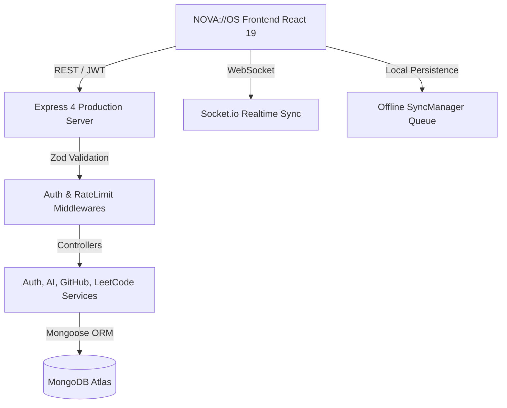

<div align="center">

# ⚡ NOVA://OS — AI-Powered Developer Workspace

**An enterprise-grade AI-powered workspace and Chrome companion built for developers.**  
Tasks, Subtasks, AI Assistant, Express Backend, Pomodoro Synthesizer, GitHub, LeetCode, Launcher, Bookmarks & Sync — all in one unified workspace.

[](LICENSE)
[](https://developer.chrome.com/docs/extensions/)
[](https://react.dev)
[](https://www.typescriptlang.org/)
[](https://expressjs.com)
[](https://www.mongodb.com/)

</div>

---

## 🏛️ Architecture Overview



---

## ✨ Features Breakdown

| Feature Module | Capabilities |
|---|---|
| 🧠 **AI Assistant** | Explain Code, Summarize Repos, Generate Git Commands, Regex, Debug Stack Traces, Refactor |
| 🛡️ **Auth & Sessions** | JWT Access & Refresh Tokens, Cookie Parser, Password Reset, Google OAuth |
| 🔄 **Cloud & Offline Sync** | Optimistic Updates, IndexedDB / LocalStorage Queue, Conflict Resolution, Background Resync |
| 🚀 **Launcher (Ctrl+K)** | Multi-mode launcher, Calculator Engine, Clipboard History, Quick Search (GitHub, npm, MDN, DevDocs) |
| ✅ **Task Matrix** | Nestable Subtasks, Recurring Schedules, Priorities, Labels, Drag & Drop, Keyboard Shortcuts, Undo Delete |
| 🍅 **Pomodoro Deck** | Circular Progress Ring, Web Audio API Synthetic Ambient Sound Generator (Rain, Cafe, Lo-Fi, Forest, White Noise) |
| 📊 **GitHub & LeetCode** | Contribution Heatmap, Pinned Repos, Recent Commits, Solved Questions, Difficulty breakdown |
| ⚙️ **Settings & Backup** | Theme Color Pickers, Clock Formats, Reduced Motion, Full Export/Import Backup JSON |

---

## 🛠️ Environment Variables

### Backend (`server/.env`)
```env
PORT=5000
NODE_ENV=development
MONGO_URI=mongodb://localhost:27017/nova-os
JWT_SECRET=nova_os_super_secret_jwt_key_2026
JWT_REFRESH_SECRET=nova_os_super_secret_refresh_key_2026
JWT_ACCESS_EXPIRATION=15m
JWT_REFRESH_EXPIRATION=7d
GOOGLE_CLIENT_ID=your_google_client_id
GOOGLE_CLIENT_SECRET=your_google_client_secret
```

### Frontend (`.env`)
```env
VITE_API_URL=http://localhost:5000/api
```

---

## 🌐 API Documentation Endpoints

### Authentication (`/api/auth`)
- `POST /api/auth/register`: Register new developer account
- `POST /api/auth/login`: Authenticate and receive JWT access & refresh token cookie
- `POST /api/auth/refresh`: Rotate refresh token
- `POST /api/auth/logout`: Revoke active session
- `POST /api/auth/forgot-password`: Dispatch reset token
- `POST /api/auth/reset-password`: Reset password with token

### Tasks (`/api/todos`)
- `GET /api/todos`: Fetch user task matrix
- `POST /api/todos`: Create new task with subtasks & recurring schedule
- `PUT /api/todos/:id`: Update task attributes
- `DELETE /api/todos/:id`: Remove task item
- `POST /api/todos/sync`: Bulk sync offline queued items

### AI Assistant (`/api/ai`)
- `POST /api/ai/process`: Process prompt with selected capability (Explain code, regex, git, debug)

---

## 🚀 Quick Start Guide

### 1. Install & Build Backend Server
```bash
cd server
npm install
npm run build
npm run dev
```

### 2. Install & Build Frontend Cockpit
```bash
npm install
npm run build
npm run dev
```

---

<div align="center">
  <sub>Built with ⚡ by the NOVA://OS Engineering Team</sub>
</div>
